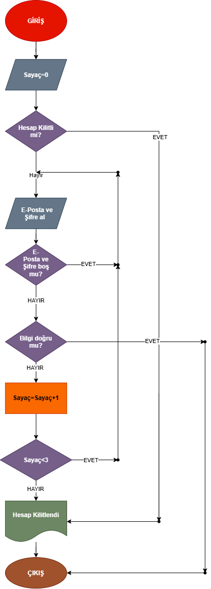

# Kullanıcı Giriş Akışı — Algoritma Diyagramı

## Projenin Amacı
Bu proje, bir web uygulamasındaki kullanıcı giriş sürecinin iş kurallarını, hata yönetimini ve hesap kilitleme mekanizmalarını modelleyen bir algoritma ve akış diyagramı sunmaktadır.

## İş Kuralları
- Hesabın kilitli olup olmadığı kontrol edilir.
- Boş e-posta veya şifre alanı için uyarı gösterilir (sayaç artmaz).
- Doğru bilgilerde başarılı giriş sonucu gösterilir.
- Yanlış girişte başarısız giriş sayacı artırılır.
- Üç başarısız denemede hesap kilitlenir.

## Akış Diyagramı

## Test Senaryoları
| Senaryo | Beklenen sonuç |
|---|---|
| Hesap kilitli | Giriş engellenir |
| E-posta veya şifre boş | Uyarı gösterilir, sayaç artmaz |
| Bilgiler doğru | Başarılı giriş |
| Üçüncü yanlış deneme | Hesap kilitlenir |

## Tasarım Kararları
Akış diyagramında kullanıcı deneyimini ve güvenlik gereksinimlerini dengelemek amacıyla öncelikle hesap kilidi kontrolü sağlanmış, ardından veri bütünlüğü (boş alan kontrolü) ve kimlik doğrulama adımları sırasıyla modellenmiştir. Yanlış denemeler sayaç mantığıyla takip edilerek 3. hatada güvenli kilitlenme sağlanmıştır.

## Öğrenci Bilgisi
- Ödev: Algoritma Tasarımı ve Akış Diyagramı
